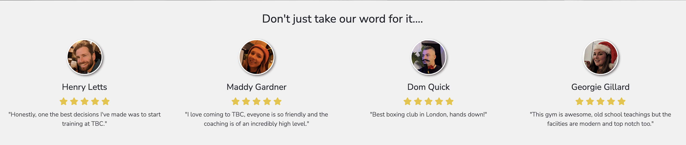
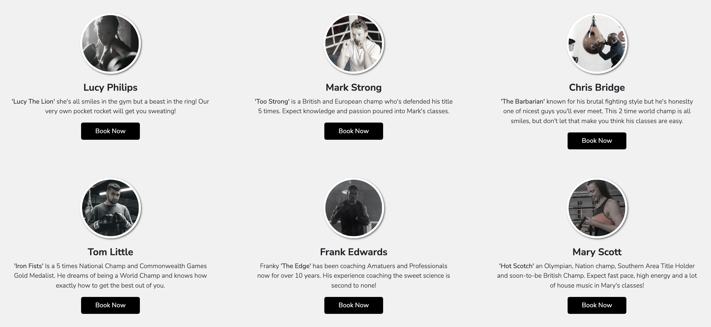
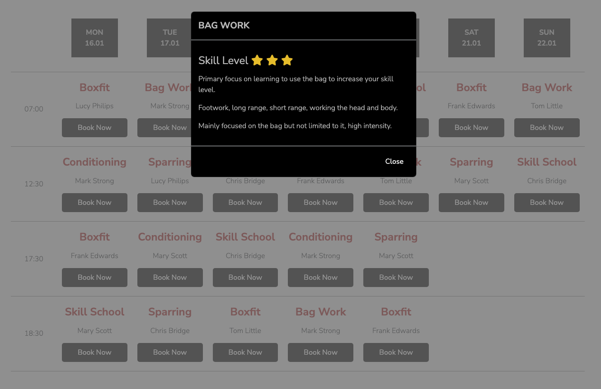
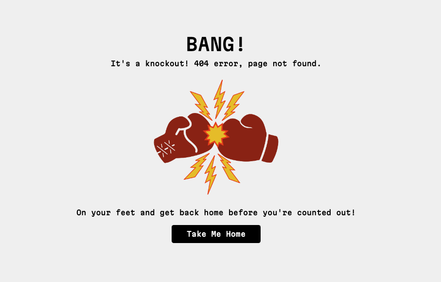
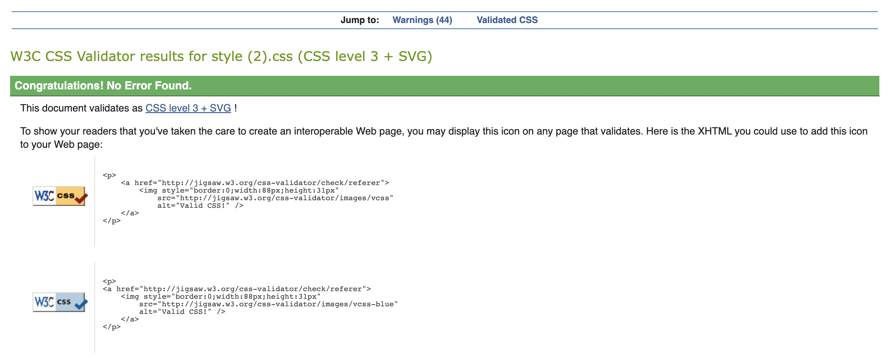
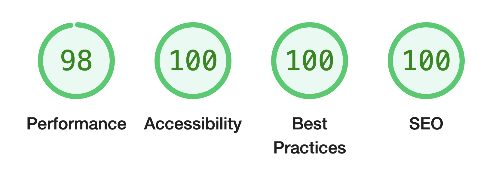

# Tooting Boxing Club
(Developer: Jamie Letts)


[Live webpage]( https://jamie2210.github.io/MSP-1-Tooting-Boxing-Club/index.html

This is the website for 'Tooting Boxing Club, it is designed to be responsible and accessible on all devices allowing easy access to the timetable, class schedule and information on club and coaches for our members and those who want to know more about us.


## Table of Content

1. [Project Goals](#project-goals)
    1. [User Goals](#user-goals)
    2. [Site Owner Goals](#site-owner-goals)
2. [User Experience](#user-experience)
    1. [Target Audience](#target-audience)
    2. [User Requrements and Expectations](#user-requrements-and-expectations)
    3. [User Stories](#user-stories)
3. [Design](#design)
    1. [Design Choices](#design-choices)
    2. [Colour](#colours)
    3. [Fonts](#fonts)
    4. [Structure](#structure)
    5. [Wireframes](#wireframes)
4. [Technologies Used](#technologies-used)
    1. [Languages](#languages)
    2. [Frameworks & Tools](#frameworks-&-tools)
5. [Features](#features)
6. [Testing](#validation)
    1. [HTML Validation](#HTML-validation)
    2. [CSS Validation](#CSS-validation)
    3. [Accessibility](#accessibility)
    4. [Performance](#performance)
    5. [Device testing](#performing-tests-on-various-devices)
    6. [Browser compatibility](#browser-compatability)
    7. [Testing user stories](#testing-user-stories)
8. [Bugs](#Bugs)
9. [Deployment](#deployment)
10. [Credits](#credits)
11. [Acknowledgements](#acknowledgements)

## Project Goals

Primary goal is to provide an informative good-looking website that showcases Tooting Boxing Club and encourages the user to come to the gym, buy classes or 1-1's or get in touch via the website.


### User Goals
- A well displayed easy to navigate website.
- Clear indication to what we and who we are and what's on offer.
- Easy access to get in touch for more information.
- Visual display of the club to help user see and get and feel for the gym.
- Call to action buttons to allow a user-friendly experience buying and booking classes.
- Enough information on the club, owners, coaches and classes for the user to have a good understanding of the company and its employees.


### Site Owner Goals
- Increase in the number of members.
- Promote the business.
- Provide a way for new and existing clients to contact the gym.
- Provide easy access to booking class and arranging private sessions.
- Provide detailed pricing and payment options.
- Provide information on the gym, its classes, coaches, and owners.

### Developer Goals
- A clean design that stands out and catches the users attention.
- A website that responds correctly on all devices where design and effectiveness is not hindered on any device.
- An easy to navigate website with clear pathways to specific pages such as class booking, prices and information on the club and coaches.
- A project the developer would be proud to display in their portfolio.


## User Experience

### Target Audience
- Ages 16 and up.
- Anyone who is interested in learning to box.
- All levels and abilities welcome.
- Companies looking for corporate team building events
- Mainly individuals but limited to.

### User Requirements and Expectations

- A simple and intuitive navigation system.
- Quickly and easily find relevant information.
- Links and functions that work as expected.
- Good presentation and a visually appealing design regardless of screen size.
- An easy way to contact the gym.
- Simple content that the user can skim read.
- Accessibility.

### User Stories

#### First-time User 
1. As a first-time user, I want to know where the gym is located.
2. As a first-time user, I want to know the prices for classes and 1-1’s.
3. As a first-time user, I want to know when classes are on throughout the week.
4. As a first-time user, I want to know more about the club, its history and its coaches.
5. As a first-time user, I want to get a feel for the classes and atmosphere in the gym.
6. As a first-time user, I want to easily contact the club should I have any questions.


#### Returning User
7. As a returning user, I want to easily log in to my account or create one.
8. As a returning user, I want access the schedule quickly to book in.
9. As a returning user, I want to find a phone number, email, or a means to contact to arrange a 1-1 or ask for more information.
10. As a returning user, I want to find the gym on social media.
11. As a returning user, I want to get directions to the gym.
12. As a returning user, I want to know more about what each individual class involves.
13. As a returning user, I want to purchase sessions, memberships or 1-1’s.

#### Site Owner 
14. As the site owner, I want users to easily access their account.
15. As the site owner, I want users to get a feel for the club and more about me.
16. As the site owner, I want the users to be able to contact us.
17. As the site owner, I want the user to easily book into classes.
18. As the site owner, I want users to easily make purchases.

## Design

### Design Choices
The layout I chose ensures each specific point of information is easy to access and follows a similar theme to ensure continuity. Tooting boxing club is a new, high end and authentic boxing gym so I want the website to be slick and clean to represent that.

### Colour
As Tooting Boxing Club is a club that is influenced by the past, I wanted to add hints of authentic and classic colour (yellow and red) used in boxing posters from the 70's and 80's - a truly classic era of boxing.

The branding colours I chose are Black, White, A slightly Mustard Yellow and a Burnt Red.

Primary Colours - Black / White

Secondary Colours - Yellow / Red

Black, Yellow and white being the most predominant as they stand out so well against each other.

I also use subtle greys when a white background to too garish.

Specific colours used on the site all taken from a colour picker in InDesign are;
1. Black: #000000
2. White: #ffffff
3. Off-white: #f1f1f1 
4. Off-white: 2 #C0C0C0 (also used for Silver)
5. Yellow: #e9c431
6. Red: #a51e1e
7. Shadow Grey: #726a6a
8. Subtle Grey: #807c7c (only used for a very small amount of text on - 'Read Me' on index.html reviews section)
9. Bronze: #CD7F32

I tested multiple options on indesign to ensure I was happy with the colours and had covered as many other options I also liked.


<details><summary>Branding Colour Ideas</summary>

</details>

### Fonts

Google fonts were used to import the 'Martian Mono and Nunito Sans' font used throughout the website:
- [Martian Mono](https://fonts.google.com/specimen/Martian+Mono?query=martian)
- [Nunito Sans](https://fonts.google.com/specimen/Nunito+Sans?query=nunito+sans)

Martian Mono only used for title headers as they stand out well being a slightly and make an impact as the user lands on the page.
<br> 
I use these fonts as they are clean, easy to read and have a smart appearance and as they are not a commonly used fonts still manage to portray a unique and individual look to them.

### Structure
The page is structure in a user friendly and visually appealing way. Upon arriving the user will notice the recognisable navigation bar, with the company logo on the left and next to that a WhatsApp symbol for quick and convenient contact via the app, all navigation links are placed on the right.

The website consists of six separate pages and a ‘Sign In’ modal: 
- A homepage with a sections giving more information on the club (Strapline and short introduction, gallery, reviews and map)
- An About page with information on the founders and why they started the club.
- A Team page that introduces the user to the coaches.
- A Prices page with details on the different options for classes and 1-1’s.
- A Class Schedule page with the class timetable and details on the different class the gym puts on via a modal.
- A Contact page with a form for getting in touch.
- The Sign In icon takes the user to a sign in modal, there is no page.

### Wireframes

<details><summary>Home</summary>

</details>
<details><summary>About</summary>

</details>
<details><summary>the Team</summary>

</details>
<details><summary>Prices</summary>

</details>
<details><summary>Class Schedule</summary>

</details>
<details><summary>Get In Touch</summary>

</details>

## Technologies Used

### Languages
- HTML
- CSS

### Frameworks & Tools
- Bootstrap v5.0
- Git
- GitHub
- Gitpod
- Tinypng
- Balsamiq
- Google Fonts
- Adobe Suite (Illustrator, Photoshop & InDesign)
- Font Awesome
- Favicon<span>.</span>io

## Features
The page consists of six pages and thirteen features.

### Logo and Navigation Bar
- Featured on all six pages
- The navbar is fully responsive and changes to a toggler (hamburger menu) on smaller screens and includes
links to the Homepage, About page, The Team page, Prices Page, Class Schedule Page and Get In Touch page.
- It allows users to easily navigate the page
- The link for the page the user is currently on is highlighted in yellow.
- The left includes the gym’s logo which also acts as a home button with a WhatsApp logo which opens WhatsApp chat with the gym when clicked.
- The navigation bar includes a sign in icon that opens a modal to sing in or sign up.
- User stories covered: 6, 7, 8, 9, 14, 17, 18.


### Hero Image / Landing Page
-	Company logo with 2 buttons underneath it one that takes the user to the schedule page and one that takes the user to the prices page.
-	Background image of two boxing gloves fist bumping depicting a sense of unity and bond, representing the ethos of the gym.
-	User stories covered: 5, 8, 13, 17, 18.


### Company Logo and Strap Line

- This introduces the user to the club ethos and principles and gives a little taste of how the user benefits from joining.
- User stories covered: 4.


### Carousel
- Introduces the user to the gym and its classes and coaches with a six-picture slide show.
- Options for the user to navigate the slide show via back and forward arrows or indicators are located to the left and right centre of the image.
- User stories covered: 5.


### Reviews
- 4 Reviews from members detailing how much they like the gym
- User stories covered: 4, 5.



### Map
- Shows the gym location on an embedded Google Maps.
- User stories covered: 1, 11.


### Footer
- Featured on all six pages.
- Consists of two separate sections: contact information and social media links.
- User stories covered: 6, 9, 10, 11.


### About
- Introduces the user to the founders, Sam and Rick and their history in boxing. 
- Provides links to their boxing achievements to find out more on their careers.
- Details why they started the gym and gives an insight to what can be expected when going.
- User stories covered: 4, 5, 15.


### The Team
- Features a short bio of the of each coach under their own profile picture.
- Under each bio is a button that links to the schedule for easy access to booking classes.
- User stories covered: 4, 5, 12, 15, 16.



### Prices 
- Pricing is broken down into 4 main titles
    1. Intro Offers
    2. Memberships
    3. Class Packages
    4. Personal Training
- This helps for easy navigation and good aesthetics.
- User stories covered: 2, 13, 14, 18.

<details><summary>Intro Offers</summary>

</details>
<details><summary>Memberships</summary>

</details>
<details><summary>Class Packages</summary>

</details>
<details><summary>Personal Training</summary>

</details>

### Class Schedule
- Weekly schedule detail what classes on are on each day of the week, what time they are on and which coach is taking the class.
- A description of the class is available with more detail on a modal when the class description is clicked.
- User stories covered: 3, 5, 8, 12, 15, 17.


### Get In Touch
- A contact form allowing an easy way for the user to ask questions or book 1-1’s. 
- User stories covered: 6, 9, 16


### Modals
- Sign In Modal on the navigation bar allows for immediate and easy log in to the users account.
- Class Modal gives a more detailed description of the class including the experience level required.
- User stories covered: 5, 7, 11.

<details><summary>Sign In Modal</summary>

</details>
<details><summary>Class Modal</summary>

</details>

### 404

- For a bit of fun, I added light hearted boxing related humour to the error page.
- Includes navigation bar and footer, with a centrally places 'Home' button for convenience.



## Testing

### HTML Validation

The W3C Markup Validation Service was used to validate the HTML of the website. All pages pass with no errors.

index.html [results](https://validator.w3.org/nu/?doc=https%3A%2F%2Fjamie2210.github.io%2FMSP-1-Tooting-Boxing-Club%2Findex.html)

about.html [results](https://validator.w3.org/nu/?doc=https%3A%2F%2Fjamie2210.github.io%2FMSP-1-Tooting-Boxing-Club%2Fabout.html) 

team.html [results](https://validator.w3.org/nu/?doc=https%3A%2F%2Fjamie2210.github.io%2FMSP-1-Tooting-Boxing-Club%2Fteam.html) 

prices.html [results](https://validator.w3.org/nu/?doc=https%3A%2F%2Fjamie2210.github.io%2FMSP-1-Tooting-Boxing-Club%2Fprices.html) 

schedule.html [results](https://validator.w3.org/nu/?doc=https%3A%2F%2Fjamie2210.github.io%2FMSP-1-Tooting-Boxing-Club%2Fschedule.html) 

contact.html [results](https://validator.w3.org/nu/?doc=https%3A%2F%2Fjamie2210.github.io%2FMSP-1-Tooting-Boxing-Club%2Fcontact.html) 

### CSS Validation
The W3C Jigsaw CSS Validation Service was used to validate the CSS of the website.
When validating just my own custom CSS it passes with no errors and flagged some warnings for the moz, o and webkit transitions used through and 1 wanring for the google fonts import used.

<details><summary>style.css</summary>

</details>

### Accessibility
The WAVE WebAIM web accessibility evaluation tool was used to ensure the website met high accessibility standards. All pages pass with 0 errors.

index.html [results](https://wave.webaim.org/report#/https://jamie2210.github.io/MSP-1-Tooting-Boxing-Club/index.html) 

about.html [results](https://wave.webaim.org/report#/https://jamie2210.github.io/MSP-1-Tooting-Boxing-Club/about.html)

team.html [results](https://wave.webaim.org/report#/https://jamie2210.github.io/MSP-1-Tooting-Boxing-Club/team.html)

prices.html [results](https://wave.webaim.org/report#/https://jamie2210.github.io/MSP-1-Tooting-Boxing-Club/prices.html)

schedule.html [results](https://wave.webaim.org/report#/https://jamie2210.github.io/MSP-1-Tooting-Boxing-Club/schedule.html)

contact.html [results](https://wave.webaim.org/report#/https://jamie2210.github.io/MSP-1-Tooting-Boxing-Club/contact.html)

### Performance 
Google Lighthouse in Google Chrome Developer Tools was used to test the performance of the website. All results scoring 90 or above.

<details><summary>index.html</summary>

</details>
<details><summary>about.html</summary>

</details>
<details><summary>team.html</summary>

</details>
<details><summary>prices.html</summary>

</details>
<details><summary>schedule.html</summary>

</details>
<details><summary>contact.html</summary>

</details>

### Performing tests on various devices 
The website was tested on the following devices:
- MacBook Pro
- Ipad Tablet
- Google Pixel 5

In addition, the website was tested using Google Chrome Developer Tools Device Toggeling option for all available device options.

### Browser compatability
The website was tested on the following browsers:
- Google Chrome
- Apple Safari
- Mozilla Firefox

### Testing user stories

#### First-time User

1. As a first-time user, I want to know where the gym is located.

| **Feature** | **Action** | **Expected Result** | **Actual Result** |
|-------------|------------|---------------------|-------------------|
| Map | On Index page scroll down the bottom | Locating a map showing the location of the gym | Works as expected |
| Footer - contact information section | On any page scroll down to the footer | Find the address of the restaurant | Works as expected |

<details><summary>Find Map / Address</summary>

</details>

2. As a first-time user, I want to know the prices for classes and 1-1’s.

| **Feature** | **Action** | **Expected Result** | **Actual Result** |
|-------------|------------|---------------------|-------------------|
| Hero Image | On Index page click on 'Buy Now' button on hero image | Find Prices page with all pricing | Works as expected |
| Navigation Bar | On any page at the top click on 'Prices' | Find Prices page with all pricing | Works as expected |

<details><summary>Find Prices</summary>

</details>

3. As a first-time user, I want to know when classes are on throughout the week.

| **Feature** | **Action** | **Expected Result** | **Actual Result** |
|-------------|------------|---------------------|-------------------|
| Hero Image | On Index page click on 'Book Now' button on hero image | Find Schedule page with class timetable | Works as expected |
| Navigation Bar | On any page at the top click on 'Schedule'  | Find Schedule page with class timetable | Works as expected |
| Coach Page | Click on any 'Book Me' button | Find Schedule page | Works as expected |

<details><summary>Find Schedule</summary>

</details>

4. As a first-time user, I want to know more about the club, its history and its coaches.

| **Feature** | **Action** | **Expected Result** | **Actual Result** |
|-------------|------------|---------------------|-------------------|
| Navigation Bar | On any page at the top click on 'About' | Find About page with more information on the founders | Works as expected |
| Navigation Bar | On any page at the top click on 'Coaches' | Find Coaches page with more information on the coaches | Works as expected |
| Company Introduction | On Index page scroll down to 'Tooting Boxing Club' title | Find introduction and short description of the gym and it's values | Works as expected |
| Slide Show Gallery | On Index page scroll down to gallery | Find images of the gym on display in a carousel | Works as expected |

<details><summary>Find About / Coaches / Introduction / Gallery</summary>

</details>

5. As a first-time user, I want to get a feel for the classes and atmosphere in the gym.

| **Feature** | **Action** | **Expected Result** | **Actual Result** |
|-------------|------------|---------------------|-------------------|
| Navigation Bar | On any page at the top click on 'About' | Find About page with more information on the founders and the gym | Works as expected |
| Navigation Bar | On any page at the top click on 'Coaches' | Find Coaches page with more information on the coaches | Works as expected |
| Company Introduction | On Index page scroll down to 'Tooting Boxing Club' title | Find introduction and short description of the gym and it's values | Works as expected |
| Slide Show Gallery | On Index page scroll down to gallery | Find images of the gym on display in a carousel | Works as expected |
| Class Modal | Click on any class name on the schedule | Find a modal pop up going into more detail of chosen class | Works as expected |

<details><summary>Find About / Coaches / Introduction / Gallery / Class Modal</summary>

</details>

6. As a first-time user, I want to easily contact the club should I have any questions.

| **Feature** | **Action** | **Expected Result** | **Actual Result** |
|-------------|------------|---------------------|-------------------|
| Navigation Bar | On any page at the top click on 'Get In Touch' | Find Contact page with contact form |
| Navigation Bar | On any page at the top click on 'WhatsApp' logo | Find WhatsApp app open with direct line to chat | Works as expected |
| Footer - contact information section | On any page scroll down to the footer | Find the email and phone number of gym | Works as expected |


<details><summary>Find Contact / WhatsApp / Email & Phone Number</summary>

</details>

#### Returning User

7. As a returning user, I want to easily log in to my account or create one.

| **Feature** | **Action** | **Expected Result** | **Actual Result** |
|-------------|------------|---------------------|-------------------|
| Navigation Bar | On any page at the top click on 'Sign In' | Find Sign In Modal | Works as expected |

<details><summary>Find Sign In</summary>

</details>

8. As a returning user, I want access the schedule to quickly to book in.

| **Feature** | **Action** | **Expected Result** | **Actual Result** |
|-------------|------------|---------------------|-------------------|
| Navigation Bar | On any page at the top click on 'Schedule' | Find class schedule and booking options | Works as expected |
| Hero Image | Click on 'Book Now' button | Find class schedule and booking options | Works as expected |
| Coach Page | Click on 'Book Me' button | Find class schedule and booking options | Works as expected |

<details><summary>Find Schedule</summary>

</details>

9. As a returning user, I want to find a phone number, email, or a means to contact to arrange a 1-1 or ask for more information.

| **Feature** | **Action** | **Expected Result** | **Actual Result** |
|-------------|------------|---------------------|-------------------|
| Navigation Bar | On any page at the top click on 'Get In Touch' | Find Contact page with contact form |
| Navigation Bar | On any page at the top click on 'WhatsApp' logo | Find WhatsApp app open with direct line to chat | Works as expected |
| Footer - contact information section | On any page scroll down to the footer | Find the email and phone number of gym | Works as expected |


<details><summary>Find Contact / WhatsApp / Email & Phone Number</summary>

</details>

10. As a returning user, I want to find the gym on social media.

| **Feature** | **Action** | **Expected Result** | **Actual Result** |
|-------------|------------|---------------------|-------------------|
| Footer - Social Media Section | On any page scroll down to the footer | Find social links on the right | Works as expected |


<details><summary>Find Contact / WhatsApp / Email & Phone Number</summary>

</details>

11. As a returning user, I want to get directions to the gym.

| **Feature** | **Action** | **Expected Result** | **Actual Result** |
|-------------|------------|---------------------|-------------------|
| Map | On Index page scroll down the bottom | Locating a map showing the location of the gym | Works as expected |
| Footer - contact information section | On any page scroll down to the footer | Find the address of the restaurant | Works as expected |

<details><summary>Find Map / Address</summary>

</details>

12. As a returning user, I want to know more about what each individual class involves.

| **Feature** | **Action** | **Expected Result** | **Actual Result** |
|-------------|------------|---------------------|-------------------|
| Class Modal | Click on any class name on the schedule | Find a modal pop up going into more detail of chosen class | Works as expected |

<details><summary>Find About / Coaches / Introduction / Gallery / Class Modal</summary>

</details>

13. As a returning user, I want to purchase sessions, memberships or 1-1’s.

| **Feature** | **Action** | **Expected Result** | **Actual Result** |
|-------------|------------|---------------------|-------------------|
| Hero Image | On Index page click on 'Buy Now' button on hero image | Find Prices page with all pricing | Works as expected |
| Navigation Bar | On any page at the top click on 'Prices' | Find Prices page with all pricing | Works as expected |

<details><summary>Find Prices</summary>

</details>

#### Site Owner 

14. As the site owner, I want users to easily access their account.

| **Feature** | **Action** | **Expected Result** | **Actual Result** |
|-------------|------------|---------------------|-------------------|
| Navigation Bar | On any page at the top click on 'Sign In' | Find Sign In Modal | Works as expected |

<details><summary>Find Sign In</summary>

</details>

15. As the site owner, I want users to get a feel for the club and more about me.

| **Feature** | **Action** | **Expected Result** | **Actual Result** |
|-------------|------------|---------------------|-------------------|
| Navigation Bar | On any page at the top click on 'About' | Find About page with more information on the founders and the gym | Works as expected |
| Navigation Bar | On any page at the top click on 'Coaches' | Find Coaches page with more information on the coaches | Works as expected |
| Company Introduction | On Index page scroll down to 'Tooting Boxing Club' title | Find introduction and short description of the gym and it's values | Works as expected |
| Slide Show Gallery | On Index page scroll down to gallery | Find images of the gym on display in a carousel | Works as expected |
| Class Modal | Click on any class name on the schedule | Find a modal pop up going into more detail of chosen class | Works as expected |

<details><summary>Find About / Coaches / Introduction / Gallery / Class Modal</summary>

</details>

16. As the site owner, I want the users to be able to contact us.

| **Feature** | **Action** | **Expected Result** | **Actual Result** |
|-------------|------------|---------------------|-------------------|
| Navigation Bar | On any page at the top click on 'Get In Touch' | Find Contact page with contact form |
| Navigation Bar | On any page at the top click on 'WhatsApp' logo | Find WhatsApp app open with direct line to chat | Works as expected |
| Footer - contact information section | On any page scroll down to the footer | Find the email and phone number of gym | Works as expected |


<details><summary>Find Contact / WhatsApp / Email & Phone Number</summary>

</details>

17. As the site owner, I want the user to easily book into classes.

| **Feature** | **Action** | **Expected Result** | **Actual Result** |
|-------------|------------|---------------------|-------------------|
| Hero Image | On Index page click on 'Book Now' button on hero image | Find Schedule page with class timetable | Works as expected |
| Navigation Bar | On any page at the top click on 'Schedule'  | Find Schedule page with class timetable | Works as expected |
| Coach Page | Click on any 'Book Me' button | Find Schedule page | Works as expected |

<details><summary>Find Schedule</summary>

</details>

18. As the site owner, I want users to easily make purchases.

| **Feature** | **Action** | **Expected Result** | **Actual Result** |
|-------------|------------|---------------------|-------------------|
| Hero Image | On Index page click on 'Buy Now' button on hero image | Find Prices page with all pricing | Works as expected |
| Navigation Bar | On any page at the top click on 'Prices' | Find Prices page with all pricing | Works as expected |

<details><summary>Find Prices</summary>

</details>

## Bugs

1. Buttons on index.html hero image

   A. Having tested their position on all devices, I notcied using a margin of a specific px cause them to be out of place on different devices. Using an 'rem' unit paired with specific media queries commands instead allows them repsond better ensuring they are in a good posotion on all devices.


##### CSS Edits
```css
            .hero-btn {
                display: block;
                text-align: center;
                z-index: 1;
                position: absolute;
                margin-top: 15rem; (originally used a pixel unit here)
            }
```
##### Media Query commands
```css
        @media screen and (min-width:820px) and (max-width:912px){
            .hero-btn{
                margin-top: 20em;
            }

        @media screen and (max-width:480px)
            .btn.btn-dark {
                width: 125px;
            }
            .hero-btn {
                font-weight: none;
            }

        @media screen and (max-width:280px)
            .hero-btn {
                margin-top: 175px;
            }
            .btn.btn-dark{
                margin-bottom: 10px;
            }
            .hero img {
                height: 15vh;
                margin-bottom: 25px;
            }
```

    B. Having looked at ths in more detail it just wasn't working correclty, it caused the logo and buttons to be at different positions on lots of different devices and was messy. I decided to re-write the code and see if there was a different way of doing it. I found a solution here is the old code and the new;

#### Old HTML
```html
            <div class="hero">
                <div class="container-fuild">
                    
                </div>
                <div class="hero-button text-center">
                    <a href="prices.html" class="button">Buy Now</a>
                    <a href="schedule.html" class="button">Book Now</a>
                </div>
            </div>
```
##### New HTML
```html
            <div class="hero">
                <div class="container-fuild hero-content">
                    
                    <div class="hero-button">
                        <a href="prices.html" class="button">Buy Now</a>
                        <a href="schedule.html" class="button">Book Now</a>
                    </div>
                </div>
            </div>
```
#### Old CSS
```css
            .hero img {
                align-items: center;
                height: 20vh;
            }

            .hero-button {
                display: block;
                text-align: center;
                position: absolute;
                top: 75%;
            }

            .button {
                width: 150px;
                margin-left: 10px;
                margin-right: 10px;
            }
```
#### New CSS
```css
            .hero-content {
                display: flex;
                text-align: center;
                align-items: center;
                flex-direction: column;
                z-index: 1;
            }

            .hero-content img {
                display: block;
                height: 185px;
                width: 195px;
            }

            .hero-button {
                display: block;
                text-align: center;
            }
```

Which meant i could remove all the messy media queries and write just one for when the screen width was really thin;
```css
            @media screen and (max-width:282px){
                .hero-button .button{
                margin-bottom: 10px;
                }
            }           
```
2. Map

The map had a grey line under so wasn't flush to the footer, after using google inspect I noticed the container was a different height the map so matched both heights to 400px which fixed the issue.

#### Orginal code
```css
            .map {
                height: 400px;
                width: 100%;
            }
```
#### Code fix
```css
            .map {
                height: 400px;
                width: 100%;
            }

            .map iframe {
                height: 400px;
                width: 100%;
                }
```
3. Schedule

Overflow scroll wasn't working correctly on scheudle page, noticed the way I'd set up the media query seemed to be the issue and it was also affecting the header and footer. Fixed the issue by changing to max-width instead of min-width of the media query and moving the units, which resovled both issues.

#### Orginal code

``` css
        @media screen and (min-width: 900px){
            .table{
                overflow-x: auto;}
            }       
```

#### Code fix

``` css
        @media screen and (max-width: 1428px){
            .table{
                overflow-x: auto;}
            }
```

I then ran into more problems as the scroll was working but but the buttons were squashing as the container width changed with the screen. To fix this I added a fixed min-width to the table in the same media query above so it now is written as;

#### **Code fix**
```css
       @media screen and (max-width: 1428px){
            .table {
                overflow-x: auto;
            }
            .schedule-style{
                min-width: 1320px;
            }
        }
```

## Deployment
The website was deployed using GitHub Pages by following these steps:
1. In the GitHub repository navigate to the Settings tab
2. On the left hand menu select Pages
3. For the source select Branch: master
4. After the webpage refreshes automaticaly you will se a ribbon on the top saying: "Your site is published at https://jamie2210.github.io/MSP-1-Tooting-Boxing-Club/team.html

You can for fork the repository by following these steps:
1. Go to the GitHub repository
2. Click on Fork button in upper right hand corner

You can clone the repository by following these steps:
1. Go to the GitHub repository 
2. Locate the Code button above the list of files and click it 
3. Select if you prefer to clone using HTTPS, SSH, or Github CLI and click the copy button to copy the URL to your clipboard
4. Open Git Bash
5. Change the current working directory to the one where you want the cloned directory
6. Type git clone and paste the URL from the clipboard ($ git clone https://github.com/YOUR-USERNAME/YOUR-REPOSITORY)
7. Press Enter to create your local clone.

### Credits

Images and logos not referenced below are owned or created by the developer.

#### Media

### Index Page

#### Gym photos were taken from [Pexels](https://www.pexels.com/), credit to (in order of appearance);

- [Julia Larson](https://www.pexels.com/@julia-larson/)
    <details><summary>Hero Image</summary>
    
    </details>
<br>

- [Kool Shooters](https://www.pexels.com/@kool-shooters/)
    <details><summary>Carousel - Bagwork</summary>
    
    </details>
<br>

- [RODNAE Productions](https://www.pexels.com/@rodnae-prod/)
    <details><summary>Carousel - Boxing Gym</summary>
    
    </details>
<br>

- [Mikhail Nilov](https://www.pexels.com/@mikhail-nilov/)
    <details><summary>Carousel - Coaching</summary>
    
    </details>
<br>

- [cottonbro studio](https://www.pexels.com/@cottonbro/) gloves touch
    <details><summary>Carousel - Sparring</summary>
    
    </details>
    <details><summary>Carousel - Dark Gym</summary>
    
    </details>
<br>

### The Team Page

- [Los Muertos Crew](https://www.pexels.com/@cristian-rojas/)
    <details><summary>Team Banner</summary>
    
    </details>
<br>

- [cottonbro studio](https://www.pexels.com/@cottonbro/)
    <details><summary>Coach Lucy</summary>
    
    </details>
<br>

- [Gustavo Fring](https://www.pexels.com/@gustavo-fring/)
    <details><summary>Coach Mark</summary>
    
    </details>
<br>

- [RODNAE Productions](https://www.pexels.com/@rodnae-prod/)
    <details><summary>Coach Chris</summary>
    
    </details>
<br>

- [Volkan Erdek](https://www.pexels.com/@volkan-erdek-311029/)
    <details><summary>Coach Tom</summary>
    
    </details>
<br>

- [Ron Lach](https://www.pexels.com/@ron-lach/)
    <details><summary>Coach Frank</summary>
    
    </details>
<br>

- [Yaroslav Shuraev](https://www.pexels.com/@yaroslav-shuraev/)
    <details><summary>Coach Mary</summary>
    
    </details>
<br>

### Prices Page
- [Kool Shooters](https://www.pexels.com/@kool-shooters/)
    <details><summary>Prices Banner</summary>
    
    </details>
<br>

### Class Schedule Page
- [Wang Motret](https://www.pexels.com/@wang-motret-35777729/)
    <details><summary>Schedule Banner</summary>
    
    </details>
<br>


## **Images**

### **Index Page**

• Gym photos were taken from [Pexels](https://www.pexels.com/), credit to;

• [RODNAE Productions](https://www.pexels.com/@rodnae-prod/)

• [Kool Shooters](https://www.pexels.com/@kool-shooters/)

• [Mikhail Nilov](https://www.pexels.com/@mikhail-nilov/)

• [cottonbro studio](https://www.pexels.com/@cottonbro/)

• [Ron Lach](https://www.pexels.com/@ron-lach/)

• [Julia Larson](https://www.pexels.com/@julia-larson/)


### **Meet the Team Page**
Coach profile pictures taken from [Pexels](https://www.pexels.com/), credit to;

• [Ron Lach](https://www.pexels.com/@ron-lach/)

• [RODNAE Productions](https://www.pexels.com/@rodnae-prod/)

• [cottonbro studio](https://www.pexels.com/@cottonbro/)

• [Yaroslav Shuraev](https://www.pexels.com/@yaroslav-shuraev/)

• [Gustavo Fring](https://www.pexels.com/@gustavo-fring/)

• [Volkan Erdek](https://www.pexels.com/@volkan-erdek-311029/)

### **Features**

## Credits

#### Table Creation
https://www.w3schools.com/cssref/css3_pr_overflow-x.php 
https://www.w3schools.com/howto/howto_css_table_responsive.asp

#### Code 

• The full-screen hero image was taken from 

#### Content

• Most content was written by the developer, some code was copied and modififed from Code Institute and Bootstrap learning modules.

#### Media


#### Ackowledgements 

- Tutor support from Code Institute for their support.
- The slack community of coders for immediate and helpful response.
- My mentor for feedback throughout.
- For help when stuck on code: [Stackoverflow](https://stackoverflow.com/), [W3 schools](https://www.w3schools.com/), [Flexbox Froggy](https://flexboxfroggy.com/)
- Code for adding WhatsApp came from [Message Bird](https://support.messagebird.com/hc/en-us/articles/360018616838-Add-an-embeddable-WhatsApp-Button-to-your-website)

## Testing User Stories from User Experiencer 

• First time visitor goals

## Deployment

### GitHub Pages

The project was deployed to GitHub using the following stages;

### Forking the GitHub Repository

### Making a Local Clone

## Further Testing 

• The webiste was tested on Google Chrome, firefox, Safari.....
• The website was viewed on a variety of devices such as Desktop, Laptop, Mobile Phone (apple and android) and tablets


[Strategy.jpg]: Strategy.jpg
[def]: https://jamie2210.github.io/MSP-1-Tooting-Boxing-Club/